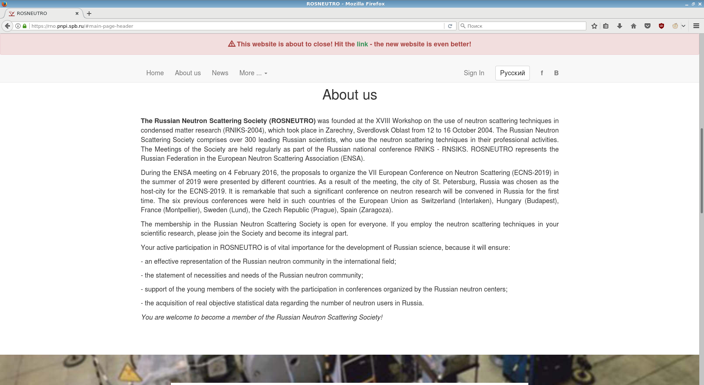
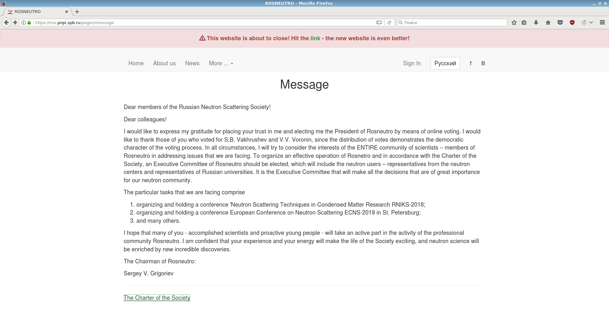
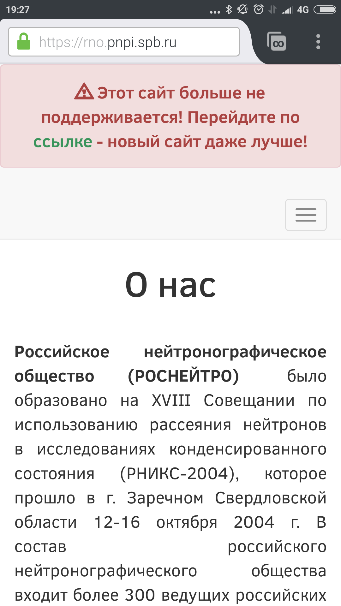
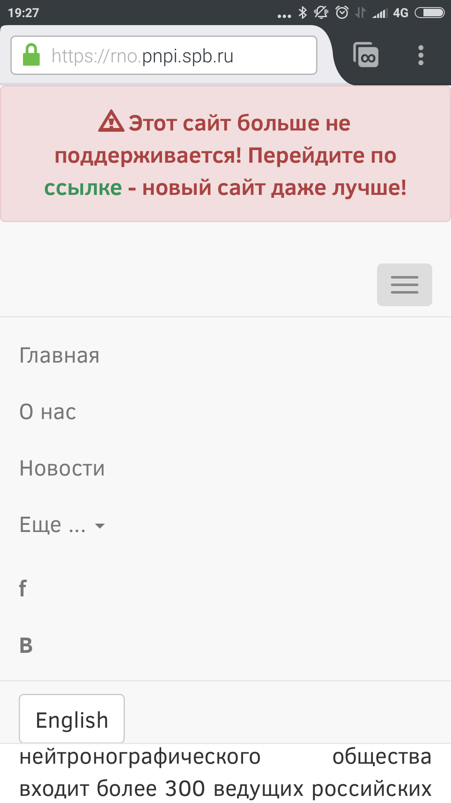
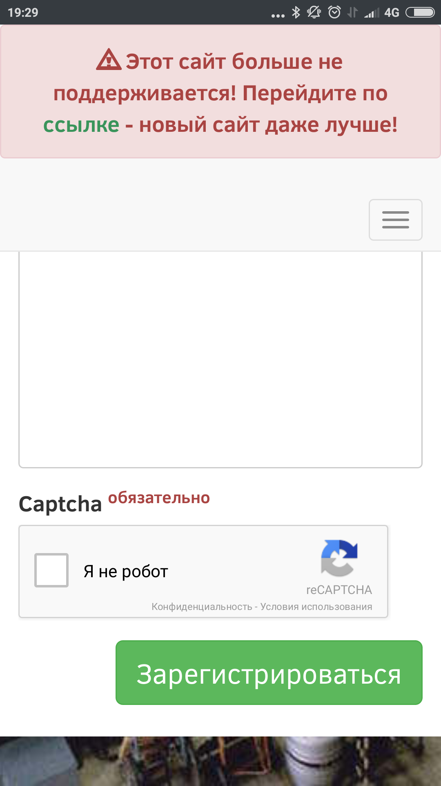

## Second reincarnation of Rosneutro website

This repo is for archaeologists and recruiters

The first website was coded in PHP MySQL and published with Apache webserver in 2008 by Sergey Seminikhin at PNPI

Originaly it was hosted at rno.pnpi.spb.ru

Present work holds static pages of this first website in ./archive/ for SEO compability

It coded in Python with Django framework in short period of time featuring translations, members registration, members emailing, some editable pages, news feed and voting for the head of the community

.. but something went wrong and it was replaced with third reincarnation at rosneutro.ru

As only developer of this website I(owner of mgatpnpi at github) decided to publish the source code 

Here is some screenshots of last hours of this website had been published

